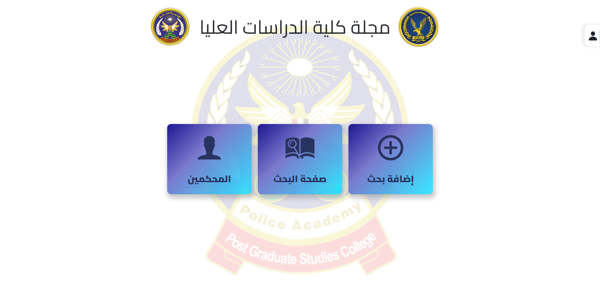

# Post graduate journal

Post graduate journal system is a full-stack project designed to streamline the process of handling research publications within Post graduate college - police academy. This system serves as a comprehensive platform for storing, managing, and reviewing all information related to research, researchers, journal editions, judges, and judge examinations.

---

## Features

- **Research Publication**: Police officers can publish their research through the system, providing details such as the research title, date of submission, and associated journal edition.

- **Researcher Information**: The system maintains a database of researchers, including their names, ranks, contact details, workplace information, and attached documents such as photos and curriculum vitae.

- **Journal Editions**: Each research is associated with a specific journal edition, capturing information about the edition date and edition number.

- **Judge Management**: The system keeps track of all judges involved in the examination process. It includes details about their degrees, names, and other relevant information.

- **Judge Examination**: For each research, the system records the judge examinations. This involves tracking outgoing and incoming letters, examination dates, and results.

- **User Authentication**: Secure user authentication system for access control and data protection.
- **Login Credentials**: Utilizes username and password-based login credentials for authorized access.

## Offline Usage

For security reasons and the sensitivity of the information and research data, this system is designed to operate offline. The offline functionality ensures that the data remains within a secure environment, accessible only to authorized personnel within the police academy.

## Table of Contents

- [Project Structure](#project-structure)
- [Frontend](#frontend)
  - [Installation](#frontend-installation)
  - [Screenshot](#home-page-screenshot)
  - [Run](#frontend-run)
  - [Build](#frontend-build)
  - [Environment Variables](#environment-variables)
  - [Technologies Used](#technologies-used)
- [Backend](#backend)
  - [Folder Structure](#backend-folder-structure)
  - [Installation](#backend-installation)
  - [Run](#backend-run)
  - [Build](#backend-build)
  - [Migrations](#backend-migrations)
  - [Environment Variables](#environment-variables-1)
  - [Technologies Used](#technologies-used-1)
  - [Database ERD](#database-erd)
  - [Database Schema](#database-schema)
  - [API Endpoints Documentation](#api-endpoints-documentation)
- [Contributing](#contributing)
- [License](#license)

---

## Project Structure

The project is organized into frontend and backend. The frontend, implemented using React, manages the user interface and interactions. The backend, developed using Node.js and Express, handles data storage, retrieval, and business logic.

### Project Folder Structure

```
+---post-graduate-journal
| +---front-end
| | +---public
| | ---src
| ---back-end
| +---src
| +---migrations
| +---spec
| ---config
```

## Frontend

The frontend structure is organized around different components, including form components for adding and editing research, details components for displaying comprehensive information, and search components for efficiently querying the database.

### Frontend Folder Structure

```
+---public
|   +---icons
|   \---images
\---src
    +---components
    |   +---detailsComponents
    |   +---fromComponents
    |   |   +---finalStep
    |   |   +---journalInfo
    |   |   +---progressBar
    |   |   +---researcherInfo
    |   |   +---researchInfo
    |   |   +---scientificExamination
    |   |   |   \---judgeExamination
    |   |   \---securityExamination
    |   +---judgeInfoComponents
    |   \---searchComponents
    +---context
    +---data
    +---fonts
    |   \---Cairo
    |       \---static
    +---hooks
    +---pages
    +---services
    +---utilities
    \---validation
```

### Home Page Screenshot



### Frontend Installation

```bash
npm run frontend:install
```

### Frontend Run

```bash
npm run frontend:start
```

### Frontend build

```bash
npm run frontend:build
```

### Environment Variables

```
REACT_APP_API_URL= your API URL
REACT_APP_BASE_URL= your Base URL
```

### Technologies Used

- HTML5
- CSS3
- JavaScript
- React.js
- react-router-dom
- axios
- bootstrap
- react-bootstrap
- react-datepicker
- react-icons
- react-toastify
- sweetalert2

## Back End

The backend structure is built on controllers, models, and routes. It encompasses functionalities such as managing researchers, handling research submissions.

### Backend Folder Structure

```
+---research-copies
+---research-summaries
+---research-summaries-ar
+---researcher-photo
+---migrations
|    \---sqls
+---spec
|   \---support
\---src
    +---helpers
    +---middleware
    +---models
    |   \---tests
    +---routes
    |   \---api
    |       +---form_submit
    |       |   +---handler
    |       |   \---tests
    |       +---journal
    |       |   \---handler
    |       +---judge
    |       |   \---handler
    |       +---judge_info
    |       |   \---handler
    |       +---research
    |       |   \---handler
    |       +---researcher
    |       |   \---handler
    |       \---user
    \---utilities
```

### Backend Installation

```bash
npm run api:install
```

### Backend Run

```bash
npm run api:start
```

### Backend build

```bash
npm run api:build
```

### Backend migrations

```bash
cd back-end
npm run migrate
```

### Environment Variables

```
PORT

# environment variables for database connection

PG_HOST
PG_USER
PG_DATABASE
PG_TEST_DATABASE
PG_PASSWORD
PG_PORT
NODE_ENV= "DEV" or "test"

# ACCESS TOKEN SECRET KEY for JWT

ACCESS_TOKEN_SECRET

# first user name and password
ADMIN_NAME="admin"
ADMIN_PASSWORD="1234567"
```

### Technologies Used

- Postgres for the database
- Node.js
- Express.js
- Typescript
- dotenv from npm for managing environment variables
- db-migrate from npm for migrations
- jsonwebtoken from npm for working with JWTs
- Unit test with Jasmine
- Formatting with Prettier and Eslint

### Database ERD

[ERD - Entity Relationship Diagram](./back-end/ERD.png)

### Database Schema

[Database Schema](./back-end/database-schema.md)

### API Endpoints Documentation

[API Endpoints Documentation](./back-end/API-enpoints.md)

## Contact

 <p align="left">

<a href="https://www.linkedin.com/in/ibrahim-ahmed-a8bba9196" target="_blank">
</a>
<a href="https://www.facebook.com/ibrahim11ahmed" target="_blank">
</a>
<a href="mailto:ibrahim11elian@gmail.com" target="_blank">
</a>
<a href="tel:+201157676284" target="_blank">
</a>
<a href="https://www.instagram.com/ibrahim11ahmed/" target="_blank">
</a>
<a href="https://twitter.com/ibrahim11elian" target="_blank">
</a>
<a href="(https://leetcode.com/ibrahim11elian/" target="_blank">
</a>

</p>

- Frontend Mentor - [@ibrahim11elian](https://www.frontendmentor.io/profile/ibrahim11elian)
